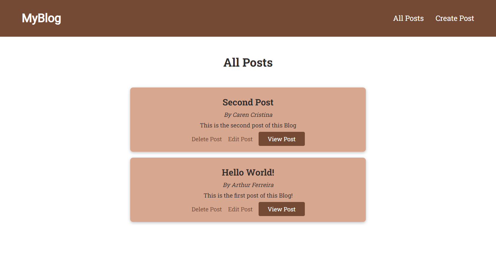

<h1 align="center">
    MyBlog
</h1>


<nav>
  <ul style="list-style:none;display:flex;justify-content:center;gap:40px;">
    <li>
      <a href="#projeto">Projeto</a>
    </li>
    <li>
      <a href="#tecnologias">Tecnologias</a>
    </li>
    <li>
      <a href="#estrutura">Estrutura</a>
    </li>
    <li>
      <a href="#requisitos">Pré-Requisitos</a>
    </li>
    <li>
      <a href="#configuracoes">Configurações</a>
    </li>
  </ul>
</nav>

<h2 id="projeto">💻 Projeto</h2>

O projeto construído é um Blog simples, onde podemos navegar, ver todas as publicações, criar novas, editar e excluí-las, desta forma teremos um CRUD (Create, Read, Update, Delete) completo.

Novas técnologias e funcionalidade:

- 02/12/23 - Introdução do JSDoc, uma API geradora de documentações para JavaScript.
- 01/12/23 - Introdução do Padrão de Projetos MVC (Model, View, Controller), onde podemos dividir e visualizar melhor as responsabilidades dentro do Back-End.
- 03/11/23 - Introdução do Sass, um Pré-Processador CSS que nos possibilita estilizar elementos HTML, com uma sintaxe e possibilidades diferentes do que usar o CSS puro;
- 31/10/23 - Introdução do arquivo .env, um gerenciador de informações sensíveis para desenvolvedores.

<h2 id="tecnologias">🚀 Tecnologias</h2>

Esse projeto foi desenvolvido com as seguintes tecnologias:

- [Node.js](https://nodejs.org/en/)
- [Express](https://expressjs.com/pt-br/)
- [MySQL](https://www.mysql.com/)
- [EJS](https://ejs.co/)
- [SASS](https://sass-lang.com/)
- [.ENV](https://www.dotenv.org/)
- [JSDoc](https://jsdoc.app/)

<h2 id="estrutura">🗃 Estrutura do Projeto</h2>

```
- backend
  - controllers
    - post.controller.js
  - data
    -database.js
  - models
    - post.model.js
  - routes
    - blog.js
  - data
    - database.js
  - views
    - includes
      - head.ejs
      - header.ejs
      - post-item.ejs
    - 404.ejs
    - 500.ejs
    - create-post.ejs
    - post-detail.ejs
    - post-list.ejs
    - update-post.ejs
- frontend
  - public
    - sass
    - images
- app.js
- jsdoc.json
- package.json
- README.md
- .gitignore
- .env.example
```

<h2 id="requisitos">👀 Pre-requisitos</h2>

Antes de começar, você precisará ter as seguintes ferramentas instaladas em seu computador:<br/>
[Git](https://git-scm.com) para clonar esse repositório;<br/>
Um editor de código como o [VSCode](https://code.visualstudio.com/);<br/>
Um Runtime, como o [NodeJs](https://nodejs.org/en), para que seu código seja executado.

<h2 id="configuracoes">👨‍💻 Iniciando o projeto</h2>

```
# Clone este repositório em sua pasta atual.
$ git clone <https://github.com/Arthur-Ferreira/SimpleBlog> .

# Ou clone este repositório em uma nova pasta.
$ git clone <https://github.com/Arthur-Ferreira/SimpleBlog>

# Acesse a pasta do projeto no terminal/cmd
$ cd "SimpleBlog"

# Instale as dependências do projeto
$ npm install

# Para iniciar o projeto
$ npm start
```

<p align="center">
Made with 🖤 by ARTHUR FERREIRA
</p>
