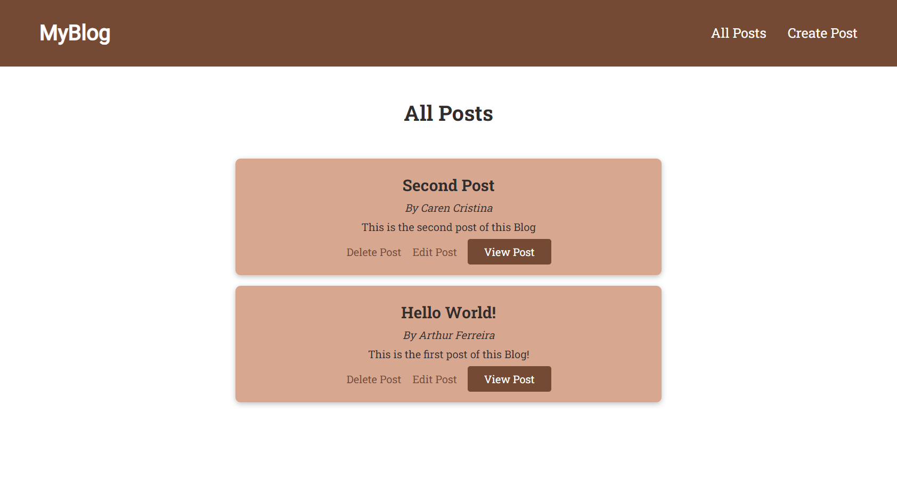

<!-- // TODO: Guest users can search for many places
// TODO: Companys can signup to collect items
  // TODO: Authentication
  // TODO: Siignin and signout -->

<h1 align="center">
    MyBlog
</h1>

<nav>
  <ul style="list-style:none;display:flex;justify-content:center;gap:40px;">
    <li>
      <a href="#-projeto">Projeto</a>
    </li>
    <li>
      <a href="#rocket-tecnologias">Tecnologias</a>
    </li>
  </ul>
</nav>

## 💻 Projeto

O projeto construído é um Blog simples, onde podemos navegar, ver todas as publicações, criar novas, editar e excluí-las, desta forma teremos um CRUD (Create, Read, Update, Delete) completo.

Novas técnologias e funcionalidade:
- Introdução do Sass, um Pré-Processador CSS que nos possibilita estilizar elementos HTML, com uma sintaxe e possibilidades diferentes do que usar o CSS puro;
- Introdução do arquivo .env, um gerenciador de informações sensíveis para desenvolvedores.

## 🚀 Tecnologias

Esse projeto foi desenvolvido com as seguintes tecnologias:

- [Node.js](https://nodejs.org/en/)
- [Express](https://expressjs.com/pt-br/)
- [MySQL](https://www.mysql.com/)
- [EJS](https://ejs.co/)
- [SASS](https://sass-lang.com/)
- [.ENV](https://www.dotenv.org/)